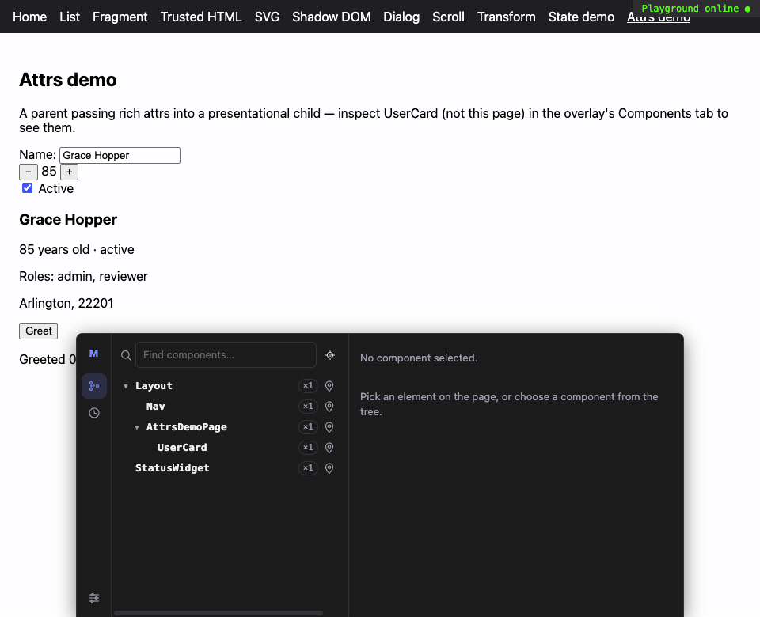

# Mithril Inspector

Developer tooling for inspecting Mithril.js applications.



## Quick start

Install the Vite plugin as a dev dependency:

```sh
pnpm add -D @mithril-inspector/vite
```

Add it to `vite.config.ts` — no other application-code changes are required:

```ts
import { defineConfig } from "vite"
import { mithrilInspector } from "@mithril-inspector/vite"

export default defineConfig({
  plugins: [
    mithrilInspector({
      editor: "code",
      mode: "full",
      ui: {
        theme: "system",
      },
    }),
  ],
})
```

Set `editor` explicitly, as above — with it unset, the resolved command falls
back to `MITHRIL_INSPECTOR_EDITOR`/`LAUNCH_EDITOR`/`VISUAL`/`EDITOR` from the
shell that started your dev server before defaulting to `"code"`, and a
project-wide `$EDITOR` (e.g. `vi`, set by many shell profiles) is easy to
inherit without noticing. It also can't be a terminal editor (`vi`, `vim`,
`nvim`, `emacs`, `nano`) — the editor launches detached with no terminal
attached, so one would start and exit without ever visibly opening. The
overlay's Settings tab shows the actual resolved command and flags this case.

Run `pnpm dev`, open the app, hover the unobtrusive "M" toggle at the bottom
of the page and click its target/crosshair icon to start picking (or open the
docked panel first via the "M" itself), then hover an element to see its
owning component and exact TypeScript source line (`SaveButton` /
`button.btn.primary` / `src/components/SaveButton.ts:28:7`). Click it to
select without triggering the app's own click handler — the result shows in
the docked panel's tree/detail view in place — then use the "Open in editor"
icon to jump straight to that line in VS Code.

### Shortcuts

| Action | Default | What it does |
| --- | --- | --- |
| Toggle picking | `Alt+Shift+M` | Turns picking on/off — sticky, stays on after you release the keys. |
| Hold to pick | `Alt` | Picking is active only while held; release to stop. |
| Open in editor | `Enter` | Opens the current hover/selection's source while picking. |
| Cancel | `Escape` | Stops picking. |
| Open editor on click | `Meta` (Cmd/Win) | Hold while clicking during picking to select the element *and* jump straight to its source, skipping the toolbar's "Open in editor" step. |
| Pass-through | `Alt+Shift` | Hold while clicking during picking to let the click reach the app underneath instead of selecting — for interacting with the real page without leaving picking mode. |

Every shortcut is rebindable, or can be disabled entirely, from the overlay's
Settings tab — changes apply immediately and persist across reloads. Not
`Ctrl` for either click modifier: macOS intercepts `Ctrl`+click as a secondary
click (opening the native context menu) before it ever reaches the page.

### Picker options

```ts
mithrilInspector({
  picker: {
    openOnClick: false,            // normal click selects only
    openPanelOnEditorOpen: false,  // Meta/Cmd+click jumps to the editor without opening the panel
    continuous: false,            // stop picking after each selection
  },
})
```

`picker.openPanelOnEditorOpen` is the key toggle for your Meta+click workflow:
leave it `false` to keep the docked panel closed when the click opens the editor,
or set it to `true` if you want the panel to expand alongside the editor jump.

The plugin is dev-only by default (`enabled` follows `NODE_ENV`) and adds no
runtime, overlay or editor endpoint to production builds.

## Other bundlers

`@mithril-inspector/rollup` is a thin Rollup adapter over
the same transform/runtime — AST transformation, virtual runtime/overlay
module resolution, watch mode and source maps, dev-only by default (active
only in `rollup --watch`/`rollup.watch()` unless `includeInProduction`).
Rollup has no HTML-injection or dev-server hooks, so overlay mounting and
editor launching need one extra step each — see `packages/rollup/README.md`.

`@mithril-inspector/esbuild` is the same adapter built on
`build.onResolve`/`build.onLoad`/`build.onEnd` — dev-only by default (active
unless `NODE_ENV=production` or the build is `minify`d, unless
`includeInProduction`). esbuild has no HTML-injection hook either, and no
dev-server hook to hang the open-in-editor endpoint on, so it ships an opt-in
`devServer` option that starts a small combined static-file + editor-endpoint
server reusing `@mithril-inspector/server` — see `packages/esbuild/README.md`
and `apps/playground-esbuild` for a working example.

`@mithril-inspector/webpack` is one plugin that runs
unmodified on both webpack and Rspack — a loader (`enforce: "pre"`) for
transformation, `EntryPlugin`-based entry injection for the runtime/overlay
bootstrap, and `devServer.setupMiddlewares` wiring for the open-in-editor
endpoint. Dev-only by default (active unless `compiler.options.mode ===
"production"`, unless `includeInProduction`). Because both bundlers treat any
`scheme:...`-shaped specifier as a URI and reject `virtual:mithril-inspector/*`
before `resolve.alias` ever runs, this adapter uses a colon-free specifier and
writes the runtime/overlay bootstrap to real files under
`node_modules/.cache/mithril-inspector` instead of an in-memory virtual module
— see `packages/webpack/README.md` for this and the other webpack/Rspack
divergences, all verified against real `webpack()` and `rspack()` builds in
`tests/integration/`.

## Monorepo workspace packages

If your app imports a sibling workspace package (pnpm/yarn/npm workspaces,
`workspace:*`) that ships a built `dist` — a component library, a shared UI
kit — you can hit two related symptoms:

- **"Open in editor" jumps into a compiled bundle** (`dist/index.esm.js`)
  instead of the package's real `.ts`/`.tsx` source. The inspector's
  `node_modules` filter is a path-based check, but bundlers resolve a linked
  workspace package's symlink to its real, on-disk location — which lives
  outside any `node_modules` folder — before handing the file to the
  inspector, so the filter never excludes it. It gets instrumented like any
  other project file, just using whatever file the bundler actually loaded
  (the built bundle, not the source it was built from).
- That bundle lives in the other package's own directory (e.g.
  `../my-ui-lib/dist/index.esm.js`), outside your app's project root, so
  clicking through fails with `FILE_OUTSIDE_ROOT` — *"The requested file is
  outside the configured project root."*

Two independent fixes, and you likely want both:

1. **Widen `projectRoots`** so the open-in-editor endpoint accepts files from
   the workspace package's directory, wherever the bundler ends up resolving
   it to:

   ```ts
   mithrilInspector({
     projectRoots: [path.resolve(__dirname, "../my-ui-lib")],
   })
   ```

2. **Alias the package to its source in dev**, so the bundler transforms the
   real `.ts`/`.tsx` files directly instead of the built bundle — this is what
   actually gets you accurate component names and source lines instead of
   positions inside generated output. Keep it dev-only so production builds
   still resolve the package normally:

   ```ts
   export default defineConfig(({ command }) => ({
     resolve: {
       alias:
         command === "build"
           ? {}
           : { "my-ui-lib": path.resolve(__dirname, "../my-ui-lib/src/index.ts") },
     },
     plugins: [
       mithrilInspector({ projectRoots: [path.resolve(__dirname, "../my-ui-lib")] }),
     ],
   }))
   ```

   Watch for subpath exports the aliased package relies on (e.g. a separate
   `my-ui-lib/index.css` built as a side effect of bundling the library's own
   entry point) — those need their own dev-only alias to the equivalent
   source file, since they won't exist until that package's own build runs.

## Status: 0.2.0

Implemented in the current version:

- Source inspector end to end: AST instrumentation, runtime source registry,
  DOM/source association, picker, highlight, tooltip, and open-in-editor.
- Component tracking: stable component IDs, display-name resolution,
  route-resolver coverage, and ancestry reconstruction.
- Overlay UI: ancestry panel, expandable component tree, attrs/state preview,
  and read-only state history with diff-focused UX.
- Diagnostics currently shipped: update counters, last render duration,
  slow-render warnings, and redraw-flash visualization (all opt-in,
  development-time features).
- Bundler adapters: Vite, Rollup, esbuild, and webpack/Rspack.
- Test coverage across package unit tests plus browser/integration suites.

See `CHANGELOG.md` for release notes and known limitations.

## Development

This repository is a pnpm workspace. Install dependencies and run the package-level checks from the repository root:

```sh
pnpm install
pnpm build
pnpm test
pnpm typecheck
pnpm test:browser
```

The packages under `packages/` are strict TypeScript, modern ESM modules. Playground applications live under `apps/`, while shared fixtures and integration suites live under `tests/`. Technical spikes are private workspace packages under `tests/fixtures/spikes/`; the decisions they validate are recorded in `docs/adr/`.

### Re-recording the demo GIF

`docs/media/inspector-demo.gif` (embedded above, and reused by the `vite`, `rollup`, `esbuild` and `webpack` package READMEs via a raw GitHub URL) is generated, not hand-captured: `scripts/record-demo.mjs` boots a real Vite dev server for `apps/playground-vite` and drives a real headless-Chromium tab with Puppeteer — picking a component, drilling into it via the Elements tab, watching the History tab's diff timeline fill in, and toggling on redraw-flash — while `page.screencast({ format: "gif" })` records straight through ffmpeg. Requires `pnpm build` first (same as any other consumer of the built packages):

```sh
pnpm build
pnpm demo:record                    # writes docs/media/inspector-demo.gif
node scripts/record-demo.mjs --headful --out /tmp/preview.gif   # watch it run, write elsewhere
```

## Testing a package locally before it's on npm

None of the `@mithril-inspector/*` packages are on the npm registry until you
run `pnpm release` (below), so a consumer project can't just `pnpm add
@mithril-inspector/webpack` yet. Every adapter (`vite`, `rollup`, `esbuild`,
`webpack`) depends on the same six shared packages —
`adapter-kit`, `overlay`, `protocol`, `runtime`, `server`, `transform` — so
whichever approach you use, that's the full set you need to make available
locally alongside the adapter itself. Build first, either way:

```sh
pnpm build   # dist/ is what every package's package.json "exports" points to
```

### Fast iteration loop: `pnpm link`

Best while you're still actively changing this repo's code — a linked
package is a symlink, so a rebuild here (`pnpm --filter @mithril-inspector/webpack build`,
or a filtered `pnpm dev`/watch if you set one up) is picked up by the
consumer project immediately, no re-linking needed. It does **not** validate
what actually ends up in the published tarball (the `files` allow-list,
missing `dependencies`, etc.) — use the tarball approach below before you
actually cut a release. pnpm v11 removed `pnpm link --global`; link the
package directories into the consumer by path instead.

```sh
# in the consumer (Vite/Rspack/etc.) project
MI_REPO=/absolute/path/to/mithril-inspector
for pkg in vite adapter-kit overlay protocol runtime server transform; do
  pnpm link "$MI_REPO/packages/$pkg"
done
```

You only need to link the *adapter* you're actually testing (swap `vite`
for `webpack`/`rollup`/`esbuild`) plus the six shared packages — always the same
six regardless of which adapter.

If the consumer project prints `[WARN] The "pnpm" field in package.json is no
longer read by pnpm`, that warning is about the consumer project's own
configuration, not these linked packages: move settings such as
`pnpm.overrides` into the consumer root's `pnpm-workspace.yaml`.

### Closest to a real install: `pnpm pack`

Packs each package the way `npm publish` would (respecting `files`, rewriting
`workspace:*` ranges in the packed `package.json` to the current local
version) and installs it from a tarball, which is the best pre-release sanity
check. Because the shared packages aren't on the registry either, pack **all
seven** and add all seven tarballs together so the consumer's resolver can
satisfy the cross-references without reaching the network for them:

```sh
# in this repo
mkdir -p /tmp/mi-tarballs
for pkg in webpack adapter-kit overlay protocol runtime server transform; do
  (cd "packages/$pkg" && pnpm pack --pack-destination /tmp/mi-tarballs)
done
```

```sh
# in the consumer project
pnpm add /tmp/mi-tarballs/mithril-inspector-webpack-*.tgz \
  /tmp/mi-tarballs/mithril-inspector-adapter-kit-*.tgz \
  /tmp/mi-tarballs/mithril-inspector-overlay-*.tgz \
  /tmp/mi-tarballs/mithril-inspector-protocol-*.tgz \
  /tmp/mi-tarballs/mithril-inspector-runtime-*.tgz \
  /tmp/mi-tarballs/mithril-inspector-server-*.tgz \
  /tmp/mi-tarballs/mithril-inspector-transform-*.tgz
```

Either way, the adapter's own peer dependency (`vite`, `rollup`, `esbuild`, or
`webpack`/`@rspack/core`) is **not** included — the consumer project keeps
using whichever one it already has installed, same as a real install. Wire
the plugin into that project's config exactly as documented in the package's
own README (`packages/webpack/README.md`, etc.) or the Quick start above for
Vite, then run the dev server and confirm the overlay's "M" toggle appears —
that's the fastest end-to-end signal the linked/packed packages actually
resolved correctly.

## Releasing

`scripts/release.mjs` bumps `protocol`, `runtime`, `transform`, `server`, `overlay`, `adapter-kit`, `vite`, `rollup`, `esbuild` and `webpack` to the same version, runs the CI gate, commits, tags and publishes each package with pnpm — run it from the repository root once the working tree is clean (commit or stash everything first):

```sh
pnpm release:dry-run       # sanity check only — prints current -> next, changes nothing
pnpm release <patch|minor|major|<version>>
```

`pnpm release patch` bumps `0.1.0` to `0.1.1`; an explicit version (e.g. `pnpm release 0.2.0`) is also accepted, and re-running it against an already-committed version just tags and publishes without an empty version-bump commit. The script:

1. refuses to run against a dirty working tree (dry runs are exempt);
2. writes the new version into all ten `package.json` files and refreshes `pnpm-lock.yaml`;
3. runs `pnpm -r build`, `pnpm -r typecheck` and `pnpm -r test` — the same gate CI runs;
4. commits the version bump, then tags `vX.Y.Z` (skipped if the tag already exists);
5. stops and prints a reminder to publish separately (see below).

Nothing is pushed automatically: review the commit and tag, then push:

```sh
git push && git push origin vX.Y.Z
```

**Publishing** is intentionally a separate step. npm 2FA one-time passwords expire in ~30 s, so prompting once per package across ten sequential publishes almost guarantees codes expire mid-run. Instead, grab a fresh OTP immediately before running the publish command, which passes the single code to all ten `pnpm publish` calls in rapid succession:

```sh
npm login
pnpm release publish --otp <code>
```

> **Prerequisite:** your npm auth token must be valid. If you see a `404 Not Found` on `PUT` (npm returns 404 rather than 401 for unauthorised scoped-package publishes), your token has expired — run `npm login` to refresh it, then retry.

`pnpm test:browser` runs the headless-Chromium integration suite in `tests/browser` (Puppeteer, no Playwright) against real, in-process Vite dev servers and a real production build — see `tests/browser/README.md`. It needs `pnpm build` to have run first, since it consumes the built `@mithril-inspector/vite` package like any other consumer.
